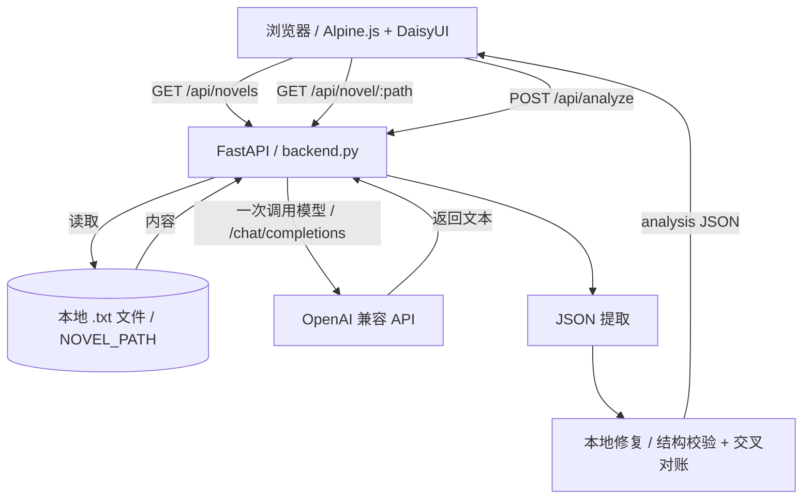

# 涩涩小说分析器

基于 LLM 的本地小说分析工具：角色关系、性癖画像、亲密场景与进度可视化。支持任意 OpenAI 兼容 API；所有敏感配置仅保存在服务端 `.env`。

## 你能得到什么

- 自动扫描本地小说目录（仅 `.txt`）
- 智能分析：角色性格/性癖、人物关系、亲密场景统计
- 世界观标签：自动提取题材/设定标签
- 雷点检测：自动识别绿帽/NTR/女性舔狗/恶堕等雷点
- 淫荡指数：女性角色的性开放程度评分（1-100分）
- 可视化：力导向关系图、首次场景时间线、关系发展进度
- 导出报告：一键导出完整分析报告（HTML格式）
- 更安全的默认值：只监听本机、前端不接触 API Key

## 快速开始（Windows）

```bash
python -m venv venv
.\venv\Scripts\activate
pip install -r requirements.txt
copy .env.example .env
start.bat
```

启动后访问：`http://127.0.0.1:6103`

## 配置（仅服务端 `.env`）

从 `.env.example` 复制为 `.env` 后修改：

```env
NOVEL_PATH=你的小说根目录
API_BASE_URL=https://your-api.com/v1
API_KEY=sk-your-api-key
MODEL_NAME=gpt-4o
HOST=127.0.0.1
PORT=6103
LOG_LEVEL=warning
DEBUG=false
```

| 配置项         | 说明                   | 示例                         |
| -------------- | ---------------------- | ---------------------------- |
| `NOVEL_PATH`   | 小说根目录             | `X:\Gallery\h小说`           |
| `API_BASE_URL` | OpenAI 兼容 API 地址   | `https://api.example.com/v1` |
| `API_KEY`      | API 密钥（仅服务端）   | `sk-xxx`                     |
| `MODEL_NAME`   | 模型名称               | `gpt-4o`                     |
| `HOST`         | 监听地址（默认仅本机） | `127.0.0.1`                  |
| `PORT`         | 端口                   | `6103`                       |
| `LOG_LEVEL`    | 日志级别               | `warning`                    |
| `DEBUG`        | 显示 LLM 原始响应错误  | `false`                      |

## 运行与开发命令

- 一键启动（会安装依赖并启动）：`start.bat`
- 手动启动：`python backend.py`
- 开发热重载：`uvicorn backend:app --reload --host 127.0.0.1 --port 6103`

## 使用步骤

1. 打开 `http://127.0.0.1:6103`
2. 顶部下拉框选择小说
3. 点击"开始分析"，查看各个 Tab 的结果
4. （可选）分析完成后点击"导出"下载 HTML 报告
5. （可选）"日志" Tab 查看详细操作日志
6. （可选）右上角"配置（只读）"里点击"测试连接"

### 功能 Tab

| Tab | 功能说明 |
|-----|---------|
| **总结** | 快速统计、角色一览、剧情总结 |
| **雷点** | 检测绿帽/NTR/女性舔狗/恶堕等雷点 |
| **角色** | 男性角色、女性角色（含淫荡指数排行） |
| **关系图** | 力导向图 + 关系详情列表 |
| **首次** | 每对角色的首次亲密场景 |
| **统计** | 完整亲密场景时间线 |
| **发展** | 关系发展里程碑 |
| **日志** | 操作日志和错误信息 |

## API 端点

| 端点              | 方法 | 说明                     |
| ----------------- | ---- | ------------------------ |
| `/api/config`     | GET  | 获取服务端配置（只读）   |
| `/api/novels`     | GET  | 扫描小说目录             |
| `/api/novel/{path}` | GET | 读取指定小说内容 |
| `/api/test-connection` | GET | 测试 API 连接            |
| `/api/analyze`    | POST | 分析小说（一次 LLM 调用） |

## 分析流程



### 核心机制

#### 1. 单次 LLM 调用 + 本地修复
- **提示词加固**：强制要求输出纯 JSON、字段齐全，并给出合法 JSON skeleton
- **本地修复兜底**：后端对模型输出做结构清洗，并进行参与者/关系的交叉对账

#### 2. 交叉对账（自动补全）
- 从场景参与者中提取所有角色名
- 自动补全缺失的角色卡片
- 从性场景自动推导缺失的关系对
- 避免关系图少人或页面解析崩溃

#### 3. 特殊处理
- **第一人称叙述者**：自动识别"我"等称呼，结合上下文推断性别与角色名
- **淫荡指数**：女性角色的性开放程度评分（1-100），包含详细分析
- **雷点检测**：识别绿帽、NTR、女性舔狗、恶堕等，标注严重程度（高/中/低）

## 输出健壮性（防"抽风"）

为了保证前端永远能渲染：

- **提示词加固**：强制要求输出纯 JSON、字段齐全，并给出合法 JSON skeleton（避免模型抄到 `true/false/章节数` 这类非 JSON 内容）。
- **本地修复兜底**（不再二次调用 LLM）：后端会对模型输出做结构清洗，并进行参与者/关系的交叉对账，尽量补齐缺失节点，避免关系图少人或页面解析崩溃。

## 雷点检测

系统能自动识别并标注以下雷点类型：

| 雷点类型 | 说明 |
|---------|------|
| **绿帽** | 男性角色的伴侣与他人发生关系（自愿/被迫/不知情） |
| **NTR** | 主角的恋人/配偶被他人占有 |
| **女性舔狗** | 女性角色过度顺从，不顾尊严追求男性 |
| **恶堕** | 纯洁/善良的角色被腐蚀堕落 |
| **其他** | 乱伦、SM程度过重、角色死亡等其他雷点 |

严重程度分级：
- **高**：核心剧情涉及，影响主角或主要配角，详细描写
- **中**：支线剧情涉及，影响次要角色，有一定描写
- **低**：背景提及、回忆片段、一笔带过

## 目录结构

```
.
├── backend.py              # FastAPI 后端：扫描文件、调用 LLM、/api/*
├── templates/
│   └── index.html          # 单页前端（Alpine.js）
├── static/
│   ├── style.css           # 样式文件
│   └── chart-view.js       # 可视化渲染（关系图、导出等）
├── requirements.txt        # Python 依赖
├── .env.example            # 配置模板（复制为 .env）
├── start.bat               # Windows 启动脚本
└── tests/                  # E2E 测试和单元测试
    ├── test_export_report_e2e.py
    ├── test_thunderzones_e2e.py
    ├── test_thunderzones.py
```

## 安全与合规

- 默认只监听 `127.0.0.1`；不要随意把 `HOST` 改成 `0.0.0.0`，否则会把本机文件列表/内容暴露给局域网。
- `.env` 不会进 Git；前端不会读取/保存/发送 `API_KEY`。
- 请确保小说与分析用途符合当地法律与内容来源授权。

## 贡献指南

请先读 `AGENTS.md`（包含仓库结构、命令、提交规范与安全注意事项）。

## 许可证

本项目采用 MIT 许可证，详见 `LICENSE`。
