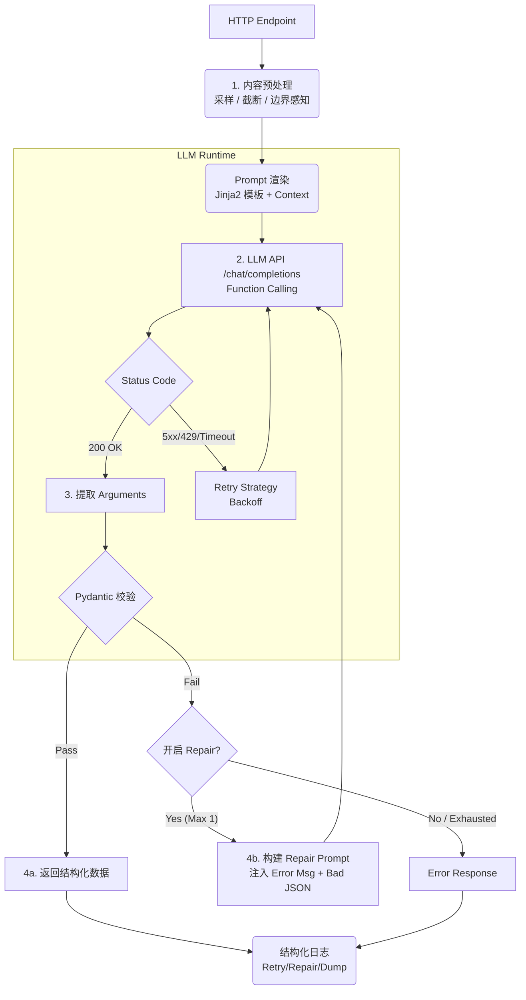

> ⚠️ 由于代码太烂+小说字数普遍超过当前模型上下文能力，故暂时搁置，随缘复活

# 涩涩小说分析器

基于 LLM 的本地小说分析工具：角色关系、性癖画像、亲密场景与进度可视化。前端不接触 API Key；所有敏感配置仅保存在服务端 `.env`。

## 关键设计（先讲结论）

- **配置分层**
  - `.env`：只放 **secrets / 服务监听 / 调试开关**
  - `config/llm.yaml`：只放 **LLM 策略**（温度/截断/retry/repair）——**固定只读此文件**
  - `config/prompts/*.j2`：Prompt 模板（Jinja2）
- **结构化输出强制**：仅使用 **Function Calling** 返回的 `tool_calls[].function.arguments`（不再做“文本里正则抽 JSON”）
- **单一事实来源**：Pydantic Schema 同时用于 tool schema 生成 + 运行时校验
- **兜底修复**：Schema 校验失败时最多触发 **1 次 Repair Pass**，且仍走 Function Calling
- **网络层重试可控**：502/503/504/429/Timeout 按 `config/llm.yaml` 策略重试与 backoff
- **可观测性**：Retry/Repair/截断/协议回退都有结构化日志（logger：`novel_analyzer.llm`）

## 快速开始（Windows）

```bash
python -m venv venv
.\venv\Scripts\python.exe -m pip install -r requirements.txt
copy .env.example .env
start.bat
```

启动后访问：`http://127.0.0.1:6103`

在页面左上角点击“选择文件...”导入本地 `.txt`（默认自动识别 UTF-8/GB18030，乱码时可手动切换编码）。

## 配置

### 1) 服务端 `.env`（必填）

从 `.env.example` 复制为 `.env` 后修改：

```env
API_BASE_URL=https://your-api.com/v1
API_KEY=sk-your-api-key
MODEL_NAME=gpt-4o
HOST=127.0.0.1
PORT=6103
LOG_LEVEL=warning
```

排查“雷点为空 / Function Call 不规范 / 返回未知”等问题时，可在 `.env` 中设置 `LLM_DUMP_ENABLED=true` 并重启服务端（会落盘 LLM 请求/响应）。

### 2) LLM 策略 `config/llm.yaml`（必填）

此文件在仓库内，后端启动时固定读取。你通常会关心：

- `sections.*.temperature`：按分析阶段设置温度
- `content_processing.max_chars/strategy/boundary_aware`：长文本采样/截断策略
- `defaults.retry.*`：网络层 retry/backoff 策略
- `repair.enabled/max_attempts`：是否启用 Repair Pass（默认最多一次）

Prompt 模板位于：`config/prompts/*.j2`。

## LLM 输出链路（当前实现）



## API 端点

- `/api/config` (GET) 获取服务端配置（只读）
- `/api/test-connection` (GET) 测试 API 连接 + Function Calling 是否可用
- `/api/analyze/meta` (POST) 基础信息 + 剧情总结
- `/api/analyze/core` (POST) 角色 + 关系 + 淫荡指数
- `/api/analyze/scenes` (POST) 首次场景 + 统计 + 发展
- `/api/analyze/thunderzones` (POST) 雷点检测

## 开发命令

- 一键启动：`start.bat`
- 手动启动（必须使用 venv）：`.\venv\Scripts\python.exe backend.py`
- 热重载（必须使用 venv）：`.\venv\Scripts\python.exe -m uvicorn backend:app --reload --host 127.0.0.1 --port 6103`

## 测试

> 必须在虚拟环境里运行（不要用系统 Python）。

- Windows（本仓库默认使用 `venv/`）：

  - （可选）进入 venv：`.\venv\Scripts\activate`
  - 运行测试（推荐直接指定 venv python，避免误用系统 Python）：`.\venv\Scripts\python.exe -m pytest -q`

- 需要 Playwright（E2E/前端渲染相关测试会用到）：
  ```bash
  .\venv\Scripts\python.exe -m pip install -r requirements-dev.txt
  .\venv\Scripts\python.exe -m playwright install chromium
  .\venv\Scripts\python.exe -m pytest -q
  ```

## 目录结构（核心）

```text
.
├── backend.py                 # FastAPI 路由层
├── src/novel_analyzer/        # LLM / schema / 配置 / 截断 / 日志
├── config/llm.yaml            # 固定读取的 LLM 策略配置
├── config/prompts/*.j2        # Prompt 模板
├── templates/index.html       # 前端
├── static/                    # 前端渲染与导出
└── tests/                     # 单元 + E2E
```
